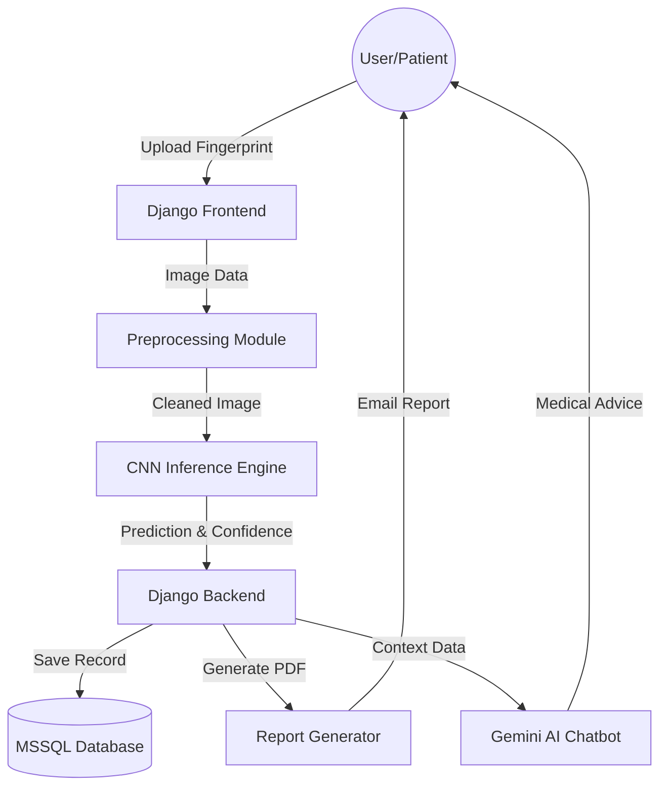

# 1st Review Report: Biometric Blood Group Detection System

## 1. Project Title & Team Details
**Project Title:** Biometric Blood Group Detection: Integrated Fingerprint Analysis and Medical Assistance System

**Team Details:**

| S.No | Name | Role |
| :--- | :--- | :--- |
| 1 | Akash @ Subish M | Team Lead |
| 2 | Stebin S | Developer |
| 3 | Muppudathi A | Developer |
| 4 | Akash T | Developer |

---

## 2. Guide Details
**Guide Name:** Mrs. Selvi T
**Designation:** Assistant Professor / CSE
**Department:** Computer Science and Engineering
**College:** [Your College Name]

---

## 3. Problem Statement
Traditional methods of blood group determination (serology) involve invasive procedures like needle pricks, which cause pain, anxiety (needle phobia), and carry potential biological hazards such as infection transmission. Furthermore, laboratory analysis consumes time for sample collection and chemical processing. There is a critical need for a **non-invasive, rapid, and hygienic** automated system that can identify blood groups instantly using dermatoglyphic features (fingerprints) and provide immediate digital reports, thereby eliminating the need for blood extraction in initial screenings.

---

## 4. Objectives
*   To develop a robust **Deep Learning model (CNN)** for the automated detection and classification of blood groups from fingerprint images.
*   To build a secure **Web-Based Platform (Django)** for patient registration, scan management, and digital history tracking.
*   To implement an **Automated Reporting System** that generates and emails professional medical reports (PDF) for each analysis.
*   To integrate an **AI-Powered Medical Assistant** using Google's Gemini API to answer patient queries and provide hematology-related advice.
*   To ensure **Data Privacy and Security** through robust user authentication and secure database management.

---

## 5. Existing Methods
Currently, blood group detection primarily relies on:

*   **Manual Serological Testing:** The standard "slide test" or "tube test" involving antigen-antibody reactions. It is accurate but invasive and painful.
*   **DNA Genotyping:** Analyzing genetic material for precise results. While highly accurate, it is cost-prohibitive and time-intensive.
*   **Near-Infrared (NIR) Spectroscopy:** Uses light absorption to detect blood types. This method requires expensive, specialized hardware sensors.
*   **Literature Survey Baseline:** Previous fingerprint-based machine learning approaches often relied on basic image processing (Gabor filters) or SVMs, achieving moderate accuracy (80-88%) without a user-friendly interface or real-time assistance.

---

## 6. Proposed Method
The proposed system introduces a holistic, non-invasive approach:

*   **Deep Learning Backend:** Utilizes a specialized **Convolutional Neural Network (CNN)** trained on fingerprint datasets to identify ridge patterns (loops, whorls, arches) correlated with blood groups.
*   **Django Framework:** A scalable and secure web architecture for conducting scans, managing patient records, and visualizing data.
*   **Intelligent Chatbot:** Integration of **Gemini-2.5-flash-lite** for personalized medical guidance and answering user queries regarding blood compatibility and health.
*   **Digital Reporting Mechanism:** Automated generation of PDF reports sent via email, reducing paper waste and manual errors.
*   **Smart Dashboard:** A centralized view for medical staff to track scan history, model confidence levels, and patient statistics.

---

## 7. Methodology / Workflow
The system operates through the following stages:

1.  **User Authentication:** Secure access for authorized medical staff/users.
2.  **Patient Registration:** Inputting patient demographics (Name, Age, Gender, Contact).
3.  **Image Acquisition:** Uploading or scanning the fingerprint image via family scanner/camera.
4.  **Preprocessing:** Normalization, resizing, and noise reduction of the fingerprint image.
5.  **Inference:** The trained CNN model (`blood_group_model.h5`) predicts the blood group class.
6.  **Result Generation:** System calculates the confidence score and determines the final result.
7.  **Interactive Support:** Users can query the **HemaAssist AI Chatbot** for further information.
8.  **Reporting:** Automatic generation of a detailed PDF report and email dispatch to the patient.

---

## 8. Literature Survey

| S.No | Paper Title | Year | Key Findings |
| :--- | :--- | :--- | :--- |
| 1 | **Blood Group Determination Using Fingerprint Features** | 2024 | Established the correlation between fingerprint ridge density/patterns and ABO blood groups. |
| 2 | **Automated Blood Group Classification Using CNN** | 2024 | Demonstrated that Deep Learning (CNN) outperforms traditional SVM methods in feature extraction accuracy. |
| 3 | **Non-Invasive Blood Group Detection using Image Processing** | 2023 | Focused on Gabor filter-based extraction, highlighting the feasibility of non-invasive detection. |
| 4 | **Dermatoglyphics and Blood Group Relationship Study** | 2023 | A statistical review confirming the biological basis for using fingerprints as a biometric marker for blood groups. |
| 5 | **Deep Learning Approaches in Biometric Healthcare** | 2023 | Discussed the optimization of CNN architectures for medical imaging tasks with limited datasets. |

---

## 9. Block Diagram / Architecture

---

## 10. Hardware Requirements
*   **Processor:** Intel Core i5 or higher / AMD Ryzen 5.
*   **RAM:** Minimum 8GB (16GB recommended for smooth model inference).
*   **GPU:** NVIDIA GTX 1050 or higher (optional, for faster training).
*   **Storage:** 256GB SSD (for fast application load times).
*   **Input Device:** Biometric Fingerprint Scanner (e.g., Mantra MFS100) or High-Res Camera.
*   **Network:** Stable internet connection for Gemini API and Email services.

---

## 11. Software Requirements
*   **Language:** Python 3.9+
*   **Framework:** Django 5.x.
*   **Libraries:** TensorFlow, Keras, NumPy, OpenCV, Pillow, Google-GenerativeAI.
*   **Database:** Microsoft SQL Server (MSSQL).
*   **API:** Google Gemini API (Generative AI).
*   **Reporting:** xhtml2pdf (or internal PDF generation tools).
*   **OS:** Windows 10/11.

---

## 12. Expected Outcome
The finalized system will provide a seamless end-to-end experience for non-invasive blood group detection with an expected accuracy suitable for preliminary screening. It will offer professionally formatted digital reports, a comprehensive patient history dashboard, and an intelligent 24/7 medical assistant, significantly reducing the physical and psychological burden of traditional blood testing.

---

## 13. Work Plan / Timeline

| Phase | Duration | Activities |
| :--- | :--- | :--- |
| **Phase 1** | Weeks 1-2 | Requirement analysis, Literature Survey, and UI Mockups. (Completed) |
| **Phase 2** | Weeks 3-4 | Dataset acquisition and ML Model training/optimization. (Completed) |
| **Phase 3** | Weeks 5-6 | Backend development (Django), Database Setup, and View Logic. (In Progress) |
| **Phase 4** | Weeks 7-8 | Frontend Integration, Dashboard Design, and Chatbot Implementation. |
| **Phase 5** | Weeks 9-10 | Testing, Validation, Error Handling, and Final Report Preparation. |

---

## 14. Modifications from Base Project
As per the requirement to identify changes from the original/reference project:

*   **Functional Shift:** Repurposed a standard biometric attendance/security system into a specialized **Medical Diagnostic Tool** for Blood Group Detection.
*   **ML Engine:** Replaced standard fingerprint matching logic with a **Classification CNN Model** specifically trained to map ridge patterns to blood group classes.
*   **Model Integration:** Integrated **Google Gemini LLM** specifically for hematology context, enabling the system to act as a medical assistant ("HemaAssist").
*   **UI/UX Overhaul:** Completely redesigned the interface with a "Red & Dark" medical theme, including custom splash screens and a professional dashboard.
*   **Enhanced Reporting:** Implemented a new reporting module that formats confidence scores and prediction results into a formal **Medical Report** sent via email, rather than just a simple on-screen display.
